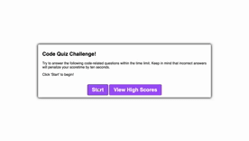

# Code_Quiz

This app is a Code Quiz that tests the user's knowledge of essential concepts of coding. Users will have 100 seconds to complete the quiz. Users will be scored based on the amoutn of time remaining. Any questions that are answered incorrectly, will result in a penalty of 10 seconds removed from the time remaining. 

User will have the ability to record their high score as well as clear all high scores. 

Technologies Used:
-HTML
-CSS
-Javascript

GitHub Pages Link:
https://wilbur125.github.io/Code_Quiz/

GitHub Repo Link:
https://github.com/wilbur125/Code_Quiz

